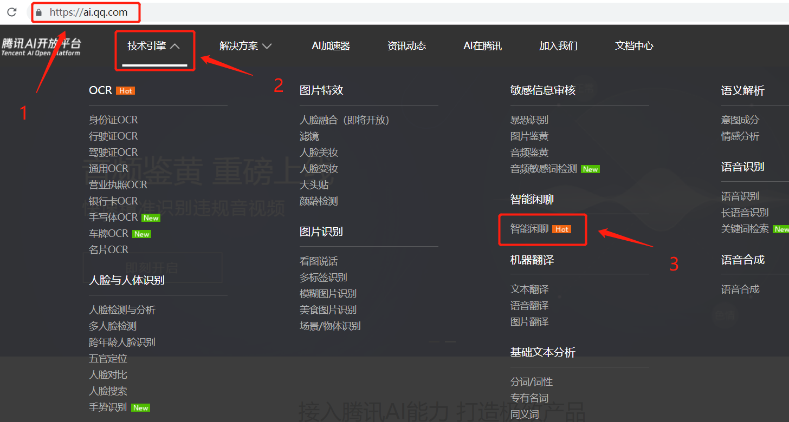
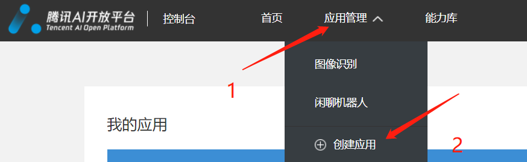
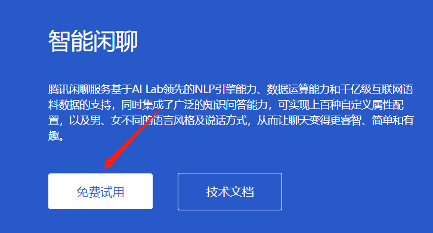

# AI入门级解决方案 :see_no_evil:

       

## 写在前面
- 本方案介绍几种（当前1种）实现当前流行的人工智能应用场景的入门级解决方案 ,推荐运行环境：Ubuntu Server 16.04.1 LTS 64位,并打开80端口
- 提交supervisor配置，暂时搁置后续的方案的计划
- 修要修改的内容在3个py文件中均有说明。
- 欢迎fork哦，star就更好了（O(∩_∩)O哈哈~）

## 聊天机器人

#### 实现功能

---

- 智能闲聊
  - 接入腾讯AI开放平台
- 情绪分析
  - 接入百度AI开放平台

#### 安装依赖

```python
sudo apt-get update
sudo apt-get upgrade
sudo apt-get install python-pip
pip install -r requirements.txt
pip3 install -r requirements3.txt
```


#### 获取代码

```
git clone https://github.com/JA1lE1/wechat_bot.git
```


#### 前端实现方式:fire:

- 准备好:100:
  - 需有一个微信公众号，订阅号即可。
    - 并在微信公众平台的基本配置中查看开发者ID并记录，==便于在代码中修改为自己的==
    - 配置好服务器设置，并在==服务器chat_bot主程序== 运行后提交相关配置
  - 一台云服务器，这里推荐使用腾讯云服务器,腾讯云+校园10元/月的费用还是较为合适，当然如果你有谷歌云服务就更好了，省去了很多备案的步骤。


#### WeRoBot:fire:

- 本解决方案使用WeRoBot的微信公众号开发框架
  - [官方文档-CN](https://werobot.readthedocs.io/zh_CN/latest/index.html)
  - 由于只处理文本数据，这里只使用@robot.text这个handler,并让服务器监听在0.0.0.0:80
    - 监听在80端口是由于微信公众号的服务器地址只支持80端口
  - ==代码部分==

#### 腾讯AI平台的应用接入

- 步骤一，选择所需要的AI技术引擎
  - 

- 步骤二，登录控制台
  - 
- 创建自己的AI应用，并填写好相应内容
  - 
- 选择免费使用某个AI引擎，并将其能力接入刚刚创建的应用之中
  - 
  - 
  - 在控制台的应用管理中选择自己刚刚创建的应用，进入后点击应用信息，记录自己的APPID 和APPKEY，或将其复制在某个文本中，以备在==代码.py== 中修改为自己APPID和APPKEY.
- 查看官方文档的智能闲聊部分可以发现只有PHP的tutorial，这里改用python实现同样的效果。
- ==代码==

#### 运行

```
python3 chat_bot.py
```


#### supervisord 启动命令

```
supervisord -c supervisord.conf
```

## 完整的步骤

- sudo su
- git clone https://github.com/JA1lE1/Wechat_chat_bot_private.git
- cd /home/ubuntu/Wechat_chat_bot
- ls
- pip install -r requirements.txt 
- pip3 install -r requirements3.txt
- 打开服务器的http80端口（AWS）
- python3 chat_bot.py
- 打开微信公众平台，提交配置（前提是配置好URL,Token，EncodingAESKey）
- echo_supervisord_conf > /etc/supervisord.conf
     cp -i supervisord.conf  /etc

     在出现提示后输出y确定覆盖文件
- mkdir /home/supervisor
- cp -R supervisor /etc
- supervisord -c /etc/supervisord.conf


